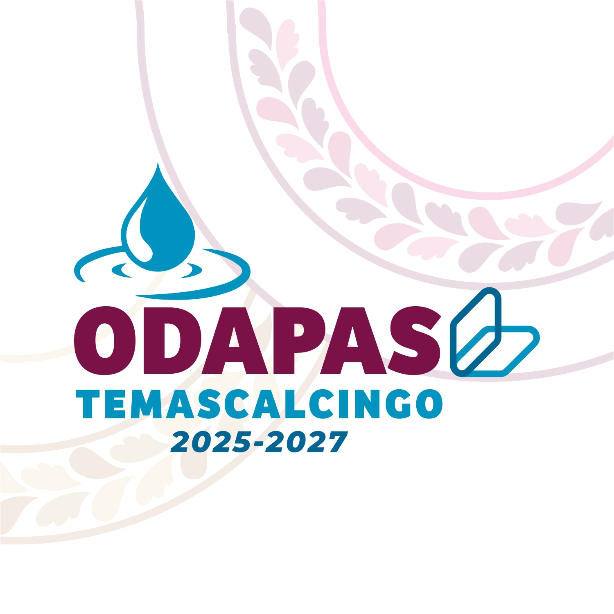
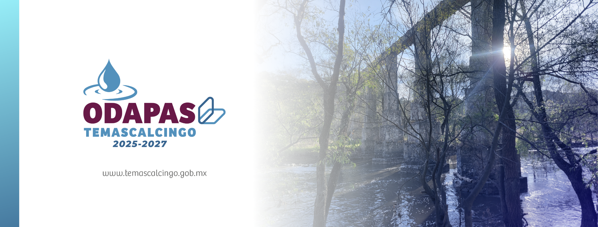

<div align="center">



# 💧 ODAPAS Temascalcingo

### Portal institucional • Servicios ciudadanos • 2025–2027


</div>

---

## 🚀 Descripción

Portal web desarrollado para modernizar la presencia digital y los servicios ciudadanos de ODAPAS Temascalcingo.

Incluye:

* sistema de reportes
* integración WhatsApp
* SEO optimizado
* diseño responsive
* arquitectura modular
* experiencia mobile-first

---

## 🛠 Stack

`Next.js` · `React` · `TypeScript` · `TailwindCSS` · `Node.js`

---

## 📷 Capturas

| Inicio                                               | Reportes                                                          |
| ---------------------------------------------------- | ----------------------------------------------------------------- |
|  |  |

---

## 📁 Estructura

```bash
/app
/components
/hooks
/lib
/public
```

---

## 🔒 Seguridad

Por privacidad y seguridad:

* no se incluyen credenciales
* no se publican configuraciones sensibles
* no se expone infraestructura interna

---

## 📌 Estado del proyecto

🟢 En desarrollo activo.

---

<div align="center">

### ⚡ Tecnología con identidad institucional

</div>
